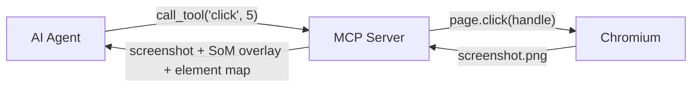

# Concepts

How BrowserControl works under the hood. If you want to debug a tricky case or push the limits, start here.

## What's here

-   :material-eye-outline:{ .lg .middle } **[Set of Marks (SoM)](set-of-marks.md)**

    ---

    Why numbered boxes beat CSS selectors for AI agents.

-   :material-graph-outline:{ .lg .middle } **[Architecture](architecture.md)**

    ---

    The action loop, the components, and the request flow.

-   :material-scale-balance:{ .lg .middle } **[How it compares](comparison.md)**

    ---

    BrowserControl vs. Playwright MCP, Stagehand, Browser-Use, AgentQL.

## Quick mental model

1. The agent calls a tool.
2. The MCP server resolves the element via `document.elementFromPoint(x, y)` and drives Chromium.
3. Chromium returns a fresh screenshot.
4. The MCP server annotates the screenshot with numbered red boxes and returns both the image and a textual element map.

That's the whole loop. Read [Architecture](architecture.md) for the details.
