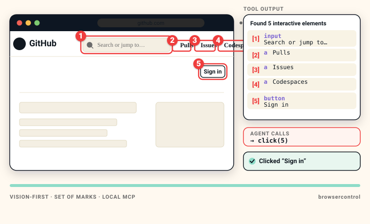

---
hide:
  - navigation
  - toc
---

<!-- ============================================================
     HERO
     ============================================================ -->

  

    
      
      Vision-first MCP browser automation
    

    <h1 class="bc-hero-headline">
      Your agent sees the page. 
      Then clicks the number.
    </h1>

    

      BrowserControl is a local MCP server that gives any AI agent a real
      browser it can <strong>see</strong>, <strong>click</strong>,
      <strong>type</strong>, and <strong>debug</strong> &mdash; using a
      vision-first <strong>Set of Marks</strong> overlay. No selectors. No
      cloud. No API bill.
    

    

      <a href="getting-started/index.md" class="md-button md-button--primary">
        Get started
      </a>
      <a href="https://github.com/adityasasidhar/browsercontrol"
         class="md-button" rel="noopener">
        View on GitHub
      </a>
    

    

      <svg viewBox="0 0 16 16" aria-hidden="true"><path fill="currentColor" d="M8 1.5 2.5 4v4c0 3.4 2.4 5.7 5.5 6.5 3.1-.8 5.5-3.1 5.5-6.5V4L8 1.5Z"/></svg> 100% local
      <svg viewBox="0 0 16 16" aria-hidden="true"><circle cx="8" cy="8" r="6.5" fill="none" stroke="currentColor" stroke-width="1.6"/><path d="M5 8.5 7 10.5 11 6.5" fill="none" stroke="currentColor" stroke-width="1.6" stroke-linecap="round" stroke-linejoin="round"/></svg> MIT licensed
      <svg viewBox="0 0 16 16" aria-hidden="true"><rect x="2.5" y="3.5" width="11" height="9" rx="1.5" fill="none" stroke="currentColor" stroke-width="1.6"/><path d="M5.5 6.5 8 8.5 10.5 6.5" fill="none" stroke="currentColor" stroke-width="1.6" stroke-linecap="round" stroke-linejoin="round"/></svg> Python 3.11+
      <svg viewBox="0 0 16 16" aria-hidden="true"><circle cx="8" cy="8" r="2.5" fill="currentColor"/><circle cx="8" cy="8" r="6.5" fill="none" stroke="currentColor" stroke-width="1.4"/></svg> MCP-compatible
    

  

  

    
  

<!-- ============================================================
     BADGE STRIP — replaces loose shields.io row
     ============================================================ -->

  <a class="bc-badge" href="https://pypi.org/project/browsercontrol/" rel="noopener">
    
    PyPI &middot; 0.1.4
  </a>
  <a class="bc-badge bc-badge--red" href="https://www.python.org/downloads/" rel="noopener">
    
    Python 3.11+
  </a>
  <a class="bc-badge bc-badge--violet" href="https://opensource.org/licenses/MIT" rel="noopener">
    
    MIT License
  </a>
  <a class="bc-badge" href="https://modelcontextprotocol.io/" rel="noopener">
    
    MCP Compatible
  </a>
  <a class="bc-badge bc-badge--ink" href="https://github.com/adityasasidhar/browsercontrol/actions" rel="noopener">
    
    CI passing
  </a>
  <a class="bc-badge" href="https://github.com/adityasasidhar/browsercontrol/stargazers" rel="noopener">
    
    Star on GitHub
  </a>

<!-- ============================================================
     THREE-STEP SoM EXPLANATION
     ============================================================ -->

  Set of Marks
  <h2 class="bc-section-title">See the page. Pick a number. Click.</h2>
  

    Every BrowserControl tool that touches the page returns the same shape:
    an annotated screenshot with numbered red boxes over each interactive
    element, plus a textual element map. The model picks a number. The click
    resolves through <code>document.elementFromPoint()</code> so overlays and
    sticky chrome never get in the way.
  

  

    

      1
      <h3 class="bc-step-title">See</h3>
      

        A screenshot is annotated with numbered red boxes over every
        interactive element &mdash; inputs, links, buttons, even shadow-DOM
        descendants and same-origin iframes.
      

      &rarr;
    

    

      2
      <h3 class="bc-step-title">Choose</h3>
      

        A compact textual element map lists each numbered target with its tag
        and label. The model picks a number &mdash; no selectors, no XPath,
        no hallucinated <code>div.flex &gt; button:nth-child(3)</code>.
      

      &rarr;
    

    

      3
      <h3 class="bc-step-title">Act</h3>
      

        The agent calls <code>click(5)</code>. BrowserControl resolves the
        actual DOM element at the box center and drives Chromium. Cookies,
        login state, and history all survive restarts.
      

    

  

<!-- ============================================================
     PROOF PANEL — annotated screenshot + tool output
     ============================================================ -->

  Proof
  <h2 class="bc-section-title">One tool call. One annotated screenshot. One click.</h2>
  

    This is the literal shape BrowserControl returns from
    <code>get_screenshot_with_summary()</code>: the marked-up page and the
    element map the model reads. A subsequent <code>click(5)</code> lands on
    the Sign in button.
  

  

    

      
    

    

      <h3>Tool output &mdash; in the model&rsquo;s context</h3>
      

        Every <code>get_*</code>, <code>click</code>, <code>type_text</code>,
        and <code>navigate</code> call returns this shape:
        an image plus a short element map. The model sees pixels and reads
        the list.
      

      <ul class="bc-proof-legend">
        <li>1inputSearch or jump to&hellip;</li>
        <li>2aPulls</li>
        <li>3aIssues</li>
        <li>4aCodespaces</li>
        <li>5buttonSign in</li>
      </ul>
    

  

<!-- ============================================================
     CAPABILITY CARDS
     ============================================================ -->

  Why BrowserControl
  <h2 class="bc-section-title">Built for the agent loop. Not for humans.</h2>
  

    Every detail below exists because AI agents fail differently than
    humans do. BrowserControl is shaped around their failure modes &mdash;
    not around a human test runner.
  

  

    

      #
      <h3 class="bc-cap-title">Vision-first, selector-free</h3>
      

        Numbered red boxes. The agent picks a number. No CSS selectors, no
        XPath, no hallucinated
        <code>div.flex-container &gt; button.btn-primary:nth-child(3)</code>.
      

    

    

      { }
      <h3 class="bc-cap-title">Shadow DOM &amp; iframe aware</h3>
      

        Recursively descends into open shadow roots and same-origin iframes
        with coordinate-offset compensation. Modern web apps just work.
      

    

    

      &#8634;
      <h3 class="bc-cap-title">True persistent sessions</h3>
      

        Uses <code>launch_persistent_context</code>. Cookies, localStorage,
        login state, and history all survive restarts. Log in once.
      

    

    

      &#9881;
      <h3 class="bc-cap-title">Built-in devtools</h3>
      

        Console logs, network requests with timing, JS errors, page
        performance, element inspection, computed styles. No second tool
        needed.
      

    

    

      &#9737;
      <h3 class="bc-cap-title">100% local &amp; private</h3>
      

        No LLM API key. No cloud. No telemetry. No usage cap. Your browsing
        stays on your machine &mdash; including the screenshots.
      

    

    

      $0
      <h3 class="bc-cap-title">Zero marginal cost</h3>
      

        Runs on your hardware. <strong>$0 per 1,000 actions</strong> &mdash;
        no API spend, no per-action fees, no surprise invoices at the end of
        the month.
      

    

  

<!-- ============================================================
     INSTALL BLOCK
     ============================================================ -->

  Install
  <h2 class="bc-section-title">Up and running in 30 seconds.</h2>
  

    Pick your installer. Chromium auto-installs on first run, so there is
    no system-level browser binary to manage.
  

<h3>Install BrowserControl</h3>

Pick whichever package manager you already have. Chromium auto-installs on first run.

  

    pip
    <pre class="bc-install-cmd"><code>pip install browsercontrol</code></pre>
  

  

    uv
    <pre class="bc-install-cmd"><code>uv add browsercontrol</code></pre>
  

  

    pipx
    <pre class="bc-install-cmd"><code>pipx install browsercontrol</code></pre>
  

  If Chromium fails to auto-install for any reason, run it once manually:
  <code>python -m playwright install chromium</code>. That&rsquo;s it.

<!-- ============================================================
     DOC PATH CARDS
     ============================================================ -->

  Documentation
  <h2 class="bc-section-title">Where to next.</h2>
  

    Pick the path that matches the moment you're in. Everything is organized
    so the next click is obvious.
  

  

    <a class="bc-doc" href="getting-started/index.md">
      Start here
      <h3 class="bc-doc-title">Getting started</h3>
      
Install, connect, and run your first session in under five minutes.

      &rarr;
    </a>
    <a class="bc-doc" href="tools/index.md">
      Reference
      <h3 class="bc-doc-title">Tool reference</h3>
      
Every MCP tool, every parameter, organized by category.

      &rarr;
    </a>
    <a class="bc-doc" href="guides/index.md">
      Patterns
      <h3 class="bc-doc-title">Guides</h3>
      
Real-world recipes: research, debugging, recording, forms, multi-tab.

      &rarr;
    </a>
    <a class="bc-doc" href="concepts/index.md">
      Under the hood
      <h3 class="bc-doc-title">Concepts</h3>
      
How Set of Marks works, the action loop, and why it beats selectors.

      &rarr;
    </a>
  

<!-- ============================================================
     FINAL CTA BAND
     ============================================================ -->

  

    <h3>Give your agent a browser that actually sees.</h3>
    

      One install. Zero cloud. The shortest path from "ask the model" to
      "watch the browser do the thing."
    

  

  

    <a href="getting-started/installation.md" class="md-button md-button--primary">
      Install BrowserControl
    </a>
    <a href="https://github.com/adityasasidhar/browsercontrol"
       class="md-button" rel="noopener">
      Star on GitHub
    </a>
  

